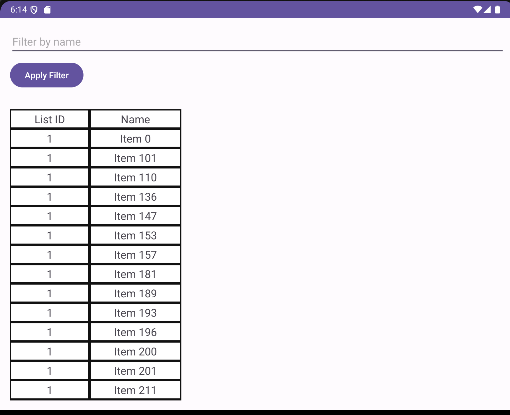
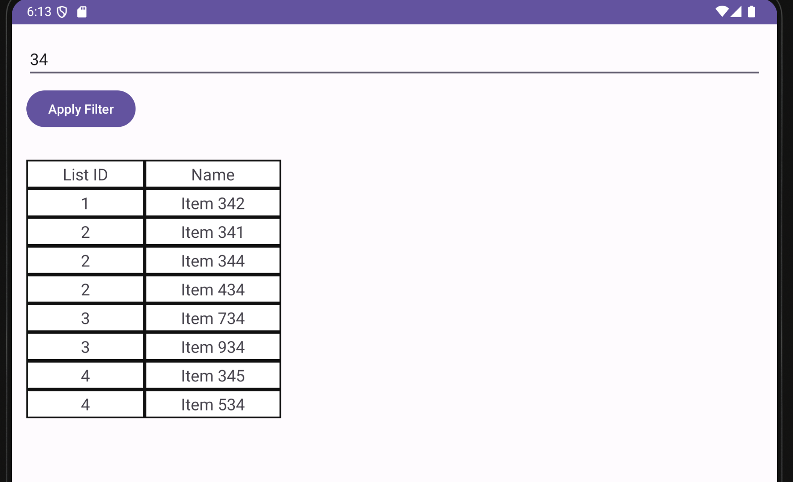
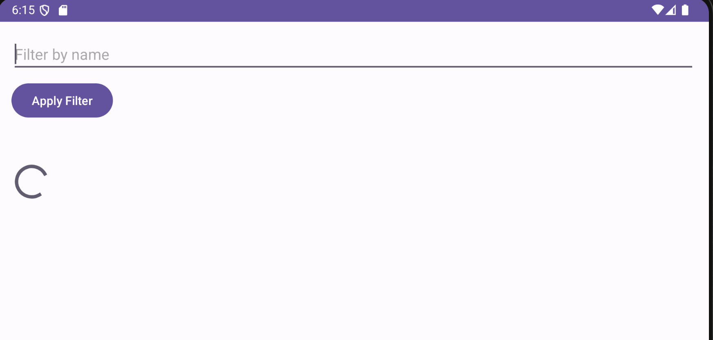

# Fetch Reward Coding Exercise - Android Engineer
This Android app fetches data from a specified JSON endpoint and presents it to the user according to defined conditions.

# Conditions
* Display all items grouped by their "listId".
* Sort the items first by "listId" and then alphabetically by "name".
* Filter out any items where "name" is blank or null.
* Present the final result in an easy-to-read list format.

# Requirements
To run this project, ensure you have the following installed:

* Android Studio
* Android SDK
* Emulator or Android device

# Implementation
To get started with this project:

* Clone this repository to your local machine using the following command:
  ```bash
  git clone https://github.com/tuschilly/fetch-reward-app.git
* Open the cloned project in Android Studio.
* Build and run the project on an emulator or an Android device.

# Demo
 ### List of IDs
* The app displays items grouped by their "listId".
 ### Data sorted by ID and then by name
* Items are sorted first by "listId" and then alphabetically by "name".
  
### Added Feature: Filter Data by Name
  
### Displaying loading icon while fetching data from URL
  

# Authors
Dax, Grad Student at Northern Illinois University.
